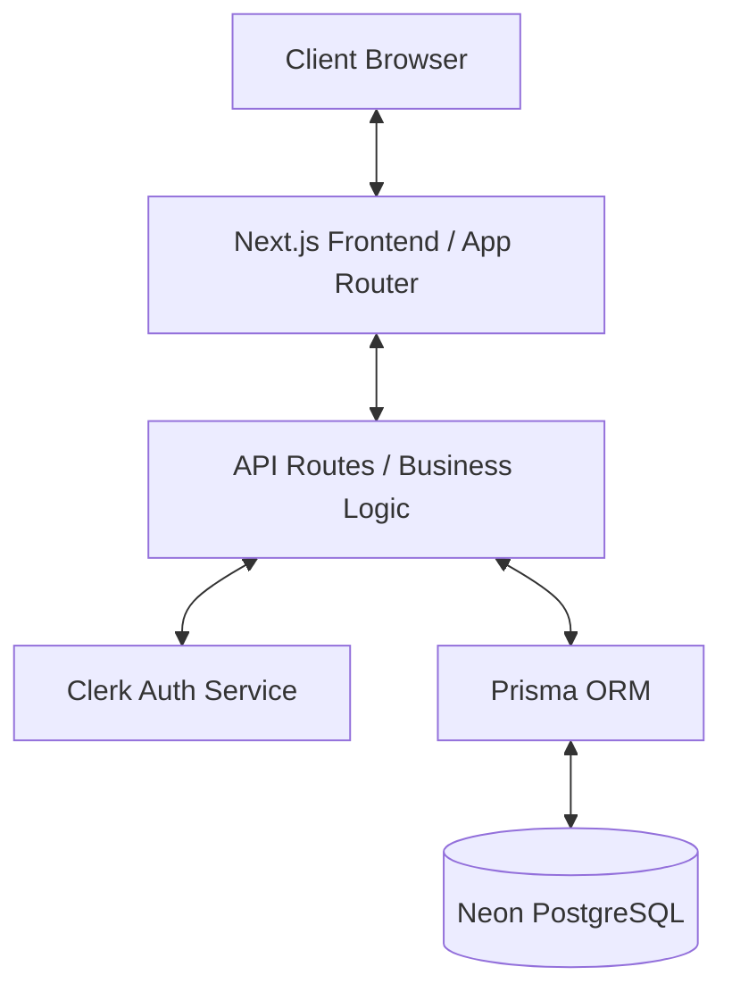

# 🎓 College Discovery - Full Stack Engineering Platform

A production-ready full-stack platform designed to streamline the college search, comparison, and decision-making process for students. Built with a focus on performance filtering, type-safe architecture, and seamless user experience.

## 🚀 Live Demo
[Visit Live Application](https://college-discovery-ybij.vercel.app/)

## 📂 Repository
[View Source Code](https://github.com/coder-rohit1477/college-discovery)


---

## 📖 Overview

College Discovery is a sophisticated full-stack engineering project developed as part of a Full Stack Engineer Internship Assignment. Unlike standard search websites, this platform is built using a modern, scalable architecture designed to handle complex data relationships and real-time user workflows.

The application enables students to explore colleges, apply multi-dimensional filters, compare institutions side-by-side, and manage their preferences through a personalized dashboard. Every engineering decision—from the choice of ORM to the data synchronization strategy—was made to ensure production-level reliability and performance.

## 🎯 Assignment Scope

**Role Selected**
* Full Stack Engineer

**Track Selected**
* Track B: College Discovery Platform

**Implemented Features**
* College Listings & Search
* Filtering & Pagination
* College Detail Pages
* Compare Colleges
* Authentication & Saved Colleges
* Production Deployment

---

## 🏗️ Architecture Overview

The platform follows a clean, layered architecture to decouple concerns and ensure maintainability.

### Layers
- **Frontend Layer:** Built with **Next.js (App Router)** for optimized rendering, **React 19** for interactive UI, and **Tailwind CSS** for a responsive design system.
- **Backend Layer:** Leverages **Next.js API Routes** (Route Handlers) to implement RESTful endpoints. Business logic is encapsulated in service classes to ensure reusability.
- **Data Layer:** Utilizes **Prisma ORM** for type-safe database access and **PostgreSQL (hosted on Neon)** for persistent, relational data storage.
- **Authentication Layer:** Integrated with **Clerk** for robust session management and user identity.
- **Deployment Layer:** Automated CI/CD pipelines via **Vercel** with edge-optimized middleware.

### Architecture Diagram


---

## 📊 Database Design

The relational schema is designed to support deep analysis and efficient querying.

- **User:** Stores profile information and links to Clerk identities.
- **College:** The central entity containing institution metadata (ranking, location, placement stats).
- **Course:** Linked to Colleges with a 1:N relationship, including fees and levels.
- **SavedCollege:** A many-to-many junction table enabling users to bookmark institutions.
- **Review:** Facilitates student feedback, contributing to the aggregated "Rating" metric.
- **ComparisonHistory:** Tracks user engagement for institutional analytics.

**Key Design Choice:** Indexes are applied on `slug`, `city`, `state`, and `ranking` fields to optimize query performance for common search and filter patterns.

---

## 🔌 API Design

The API is built on REST principles, utilizing **Zod** for strict request validation.

- **Search APIs:** Implements case-insensitive partial matching across college names and locations.
- **Filtering APIs:** Dynamic filtering by state, city, college type, and rating thresholds.
- **Pagination APIs:** Server-side offset-based pagination to ensure efficient data delivery.
- **Saved Colleges APIs:** Secure endpoints for managing user-specific favorites, protected by Clerk.
- **Comparison APIs:** Aggregates data for side-by-side analysis, optimizing data retrieval through Prisma's `include` feature.

---

## ✨ Key Features

| Feature | Implementation Detail | Why it Matters |
| :--- | :--- | :--- |
| **Advanced Filtering** | Server-side query building using Prisma utilities. | Reduces client-side processing and enables deep-linking via URL state. |
| **Side-by-Side Comparison** | Persistent state management with Zustand and local storage. | Streamlines the decision-making process for users. |
| **Personalized Dashboard** | Real-time synchronization between Clerk and local Postgres records. | Provides a tailored experience and data persistence. |
| **Type-Safe Data Flow** | End-to-end TypeScript integration from DB schema to UI components. | Minimizes runtime errors and improves developer velocity. |
| **Responsive UI** | Shadcn UI primitives with customized Tailwind themes. | Ensures accessibility and high performance across all devices. |

---

## 🔐 Authentication & Authorization

Authentication is handled via **Clerk**, providing:
- **Secure Sessions:** Managed JWT-based authentication.
- **Protected Actions:** API-level checks ensure that actions like "Saving a College" are only accessible to authenticated users.
- **Data Isolation:** User-specific records are queried using unique IDs synchronized between Clerk and the local database.
- **Session Handling:** Seamless login/logout flows with zero-knowledge of passwords on our servers.

---

## 🌐 Deployment

The application is deployed using a modern cloud stack.

| Service         | Purpose                          |
| --------------- | -------------------------------- |
| Vercel          | Frontend Hosting & Deployment    |
| Neon PostgreSQL | Production Database              |
| Prisma ORM      | Database Access Layer            |
| Clerk           | Authentication & User Management |

### Deployment Flow

User Browser
→ Vercel
→ Next.js Application
→ Prisma ORM
→ Neon PostgreSQL

---

## 🛠️ Engineering Decisions

- **Why Next.js?** Chosen for its hybrid rendering (SSR/SSG), built-in API routing, and excellent developer experience.
- **Why Prisma?** Provides a robust type-safety layer and auto-generated migrations, ensuring database consistency.
- **Why PostgreSQL?** A reliable, relational database capable of handling complex relationships required for college-course data.
- **Why Server-side Filtering?** By performing filtering on the server, we minimize the data payload sent to the client and improve SEO/deep-linking capabilities.
- **Why Zustand?** A lightweight alternative to Redux for managing comparison lists without unnecessary boilerplate.

---

## 📂 Project Structure

```text
src/
├── app/                # Next.js App Router (Pages, Layouts, API Routes)
├── components/         # Shared UI components (Shadcn, Layout, Providers)
├── features/           # Domain-driven feature modules
│   ├── colleges/       # College-specific logic (Hooks, Services, Components)
│   ├── auth/           # Authentication-related abstractions
│   └── compare/        # Comparison tool logic
├── hooks/              # Reusable React hooks
├── lib/                # Shared utilities and singleton instances (Prisma, Auth)
├── stores/             # Client-side state management (Zustand)
└── types/              # Global TypeScript definitions
```

---

## 🚀 Technical Highlights

- **Optimized Data Fetching:** Implemented `React Query` for intelligent caching and loading state management.
- **Database Indexing:** Strategic use of indexes for high-traffic search fields.
- **Clean Code Architecture:** Separation of concerns using Service classes for business logic and Zod schemas for validation.
- **Deployment Strategy:** Production deployment on Vercel with Neon PostgreSQL ensures high availability.

---

## 🔮 Future Improvements

- **Real-time Analytics:** Implement a dashboard for tracking college popularity trends.
- **Comparative Charts:** Integrate visualization libraries for visual comparison of fees and placement statistics.
- **Enhanced Search:** Implement more advanced search algorithms or dedicated search providers for larger datasets.

---

## 🏆 Project Highlights

* Full Stack Engineering Assignment Submission
* Production Deployment on Vercel
* PostgreSQL Database Integration
* Clerk Authentication
* Prisma ORM Integration
* Responsive Mobile-Friendly Design
* College Search, Filtering & Pagination
* College Comparison System
* Saved Colleges Functionality
* Type-Safe Development with TypeScript

---

## 👤 Author

**Rohit Kumar Yadav**
*Full Stack Engineer*

- [GitHub Profile](https://github.com/coder-rohit1477)
- [Project Repository](https://github.com/coder-rohit1477/college-discovery)
- [Live Application](https://college-discovery-ybij.vercel.app/)

---

## 🛠️ Installation & Setup

### Prerequisites
- Node.js 18+
- npm / yarn / pnpm

### 1. Clone the Repository
```bash
git clone https://github.com/coder-rohit1477/college-discovery.git
cd college-discovery
```

### 2. Install Dependencies
```bash
npm install
```

### 3. Environment Configuration
Create a `.env` file in the root:
```env
DATABASE_URL="your-postgresql-url"
NEXT_PUBLIC_CLERK_PUBLISHABLE_KEY="your-clerk-key"
CLERK_SECRET_KEY="your-clerk-secret"
```

### 4. Database Setup
```bash
npx prisma generate
npx prisma migrate dev
npm run seed
```

### 5. Run Development Server
```bash
npm run dev
```
Open [http://localhost:3000](http://localhost:3000) to view the application.
